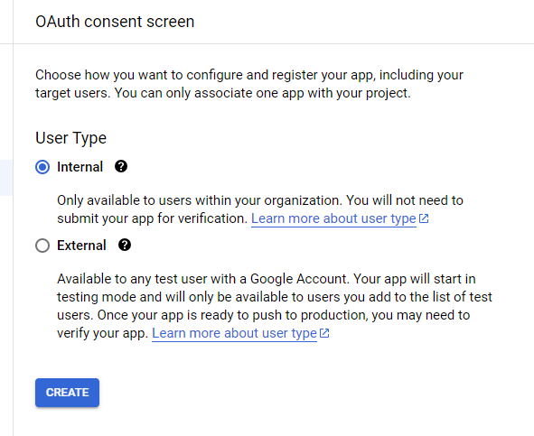
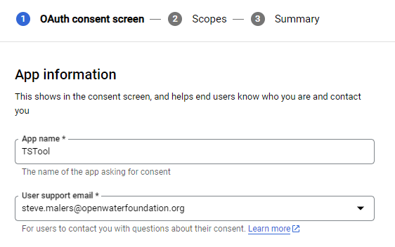
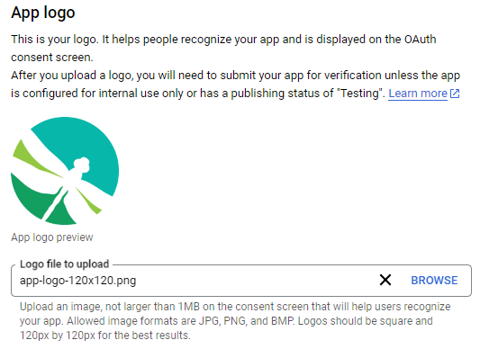
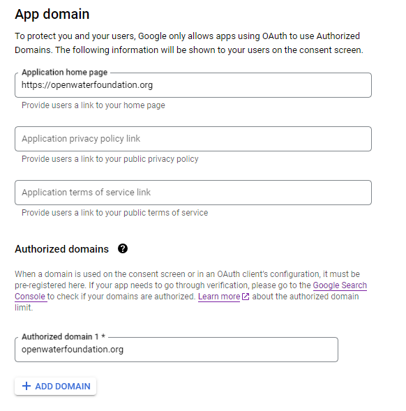
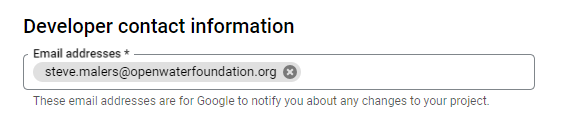
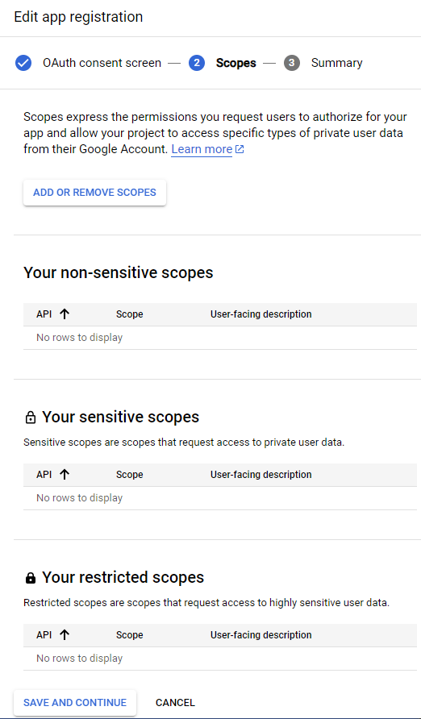
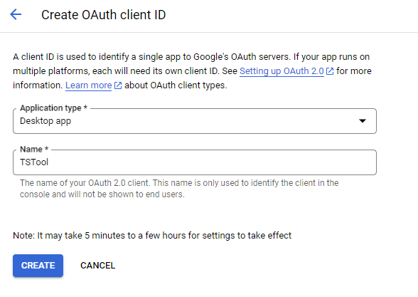

# TSTool / Enable API #

This appendix describes how to enable the Google Drive API,
which is necessary to enable Google Drive plugin features.

*   [Overview](#overview)
*   [Enable API](#enable-api)
*   [Configuring an Internal Application](#configuring-an-internal-ppplication)
    +   [Configure the OAuth consent screen](#configure-the-oauth-consent-screen)
    +   [Configure Scopes](#configure-scopes)
*   [Authorize Credentials for a Desktop Application](#authorize-credentials-for-a-desktop-application)
    +   [Using OAuth](#using-oauth)
    +   [Using a Service Account](#using-a-service-account)

-------

## Overview ##

TSTool is used with Google Drive to automate file uploads and downloads.
The TSTool Google Drive plugin is developed and tested on Windows but can also be installed on Linux.
Google Drive is available if a plan has been purchased from Google, for example Google Workspace.

*   See the [Google Drive download page](https://www.google.com/drive/download/).

Once installed, login to Google Drive, which typically maps drive `G:` on Windows.

## Enable API ##

The Google Drive API must be enabled in the Google account.

*   Because TSTool is written in Java,
    see the [Java quickstart / Enable the API](https://developers.google.com/drive/api/quickstart/java) documentation.
*   See the [Cloud APIs / Getting started](https://cloud.google.com/apis/docs/getting-started) documentation

Clicking on the ***Enable the API*** button on the above page will open the Google Cloud Console.
The API must be enabled for a project.
If a suitable project does not exist, create one by selecting the ***CREATE PROJECT*** button.
For example create a project AbcOps for an organization 

Browse the available APIs using the link
[`https://console.cloud.google.com/apis/library/browse`](https://console.cloud.google.com/apis/library/browse).

Select the Google Drive API and then select ***Enable***.

## Configuring an Internal Application ##

An internal application is suitable for internal organization use.

### Configure the OAuth consent screen ###

*   Because TSTool is written in Java,
    see the [Java quickstart / Configure the OAuth consent screen](https://developers.google.com/drive/api/quickstart/java) documentation.

Click the ***Go to OAuth consent screen*** button.

Then select ***Internal*** as shown below.

**

**

**

Internal Application OAuth Consent Screen (<a href="../internal-app-oauth-consent-screen.png">see full-size image)</a>

**

Enter the information for the application, for example as shown below.

**

**

**

App Information (<a href="../app-information.png">see full-size image)</a>

**

**

**

**

App logo (<a href="../app-logo.png">see full-size image)</a>

**

**

**

**

App domain (<a href="../app-domain.png">see full-size image)</a>

**

**

**

**

Developer Contact (<a href="../developer-contact.png">see full-size image)</a>

**

Press ***SAVE AND CONTINUE*** to continue to the Scopes configuration.

### Configure Scopes ###

Scopes can be configured to control the type of data that can be accessed.
The initial ***Scopes*** page is as follows.

**

**

**

Initial Scopes Configuration (<a href="../scopes-init.png">see full-size image)</a>

**

Although the Google Drive API could be used for sensitive scopes (user data),
it is recommended that the API is used for files that are not sensitive,
such as project data and datasets.
For example, data that are used to automate an organizations operations can be used with the API,
but not employee personal data.

Use the ***ADD OR REMOVE SCOPES*** button.

Search for "Google Drive" to see scopes for Google Drive.
Limit the scope as appropriate, for example select ***Scope*** `../auth/drive file`,
which has a ***User-facing description*** `See, edit, create, and delete only the specific Google Drive files you use with this app`.
**TODO: How are the folders used with the app specified?**

Press ***SAVE AND CONTINUE***.

## Authorize Credentials for a Desktop Application ##

The previous section enabled the API.
It is also necessary to authorize credentials for a desktop application (TSTool with Google Drive plugin).
The application can be authorized in several ways.

### Using OAuth ###

This approach results in an interactive authentication at runtime,
typically via a web browser.
Consequently, it is not suitable for processes that need to run unattended (batch or "headless").

*   Because TSTool is written in Java,
    see the [Java quickstart / Configure the OAuth consent screen](https://developers.google.com/drive/api/quickstart/java) documentation.

1.  In the Google Cloud console ([`https://console.cloud.google.com`](https://console.cloud.google.com),
    go to the ***Menu / APIs & Services / Credentials***.
    The ***Go to Credentials*** link on the above page can be used.
2.  Click ***Create Credentials > OAuth client ID***.
3.  Click ***Application type > Desktop app***.
4.  In the ***Name*** field, type a name for the credential.
    This name is only shown in the Google Cloud console.
    **

    
    
**
5.  Click ***Create***. The OAuth client created screen appears, showing your new Client ID and Client secret.
6.  Click ***OK***. The newly created credential appears under OAuth 2.0 Client IDs.
    Save the downloaded JSON file as credentials.json, and move the file to your working directory.
    For example, save in `C:/Users/user/AppData/Local/TSTool/GoogleDrive/credentials.json`,
    which is a folder that is only visible to the specific user.

The configuration that was created above can be reviewed and edited from the Google Cloud console.

### Using a Service Account ###

A service account can be used to allow for unattended execution of software,
for example automated processes that run on a schedule.
Each service account must have an email account,
which is used for identification.

In the Google Cloud Console ***API / Service Details / Google Drive API*** web page,
click on ***CREATE CREDENTIALS / Service Account***.

Create a service account and specify the ***Service account details***.
For example, use the following:

*   account name `xxx-ops` for an organization's automated operations (replace `xxx` with something appropriate)
*   account ID `xxx-ops`
*   an email address will automatically be generated for the account ID

Press ***CREATE AND CONTINUE*** to create the service account and continue with configuration.

The ***Grant this service account access to project*** section allows a project to be assigned,
with role(s) and conditions.
This is used to restrict the access for the service account.
Use the Viewer role for read-only access and the Editor role for create, update, and delete permissions.

To further restrict the service account, use the ***ADD IAM CONDITION***.
For example, add a condition to restrict access to only certain folders.
See the following:

*   [Resource attributes for IAM Conditions](https://cloud.google.com/iam/docs/conditions-resource-attributes)

However, Google Drive does not appear to support the same conditions used with Google Cloud Storage.
Therefore, to be safe, consider selecting the Viewer role initially.

Press ***CONTINUE*** to save the settings and continue with the configuration.

The ***Grant users access to this service account*** section allows users to be specified to access the service account.

Press ***Done*** to save the changes.

Next, generate the service account key JSON:

1.  In the ***Service accounts*** section, find the service account.
2.  Click on the pencil/edit icon next to the service account name.
3.  Navigate to the ***Keys*** tab and click on ***Add Key.***
4.  Choose the JSON key type and click ***Create***.
    This will download a JSON file containing the credentials for the service account.
5.  Move the file to the following location, which is the default for the TSTool Google Drive plugin:
    *   Windows:  `%APPDATALOCAL%\TSTool\GoogleDrive\api-key.json`
