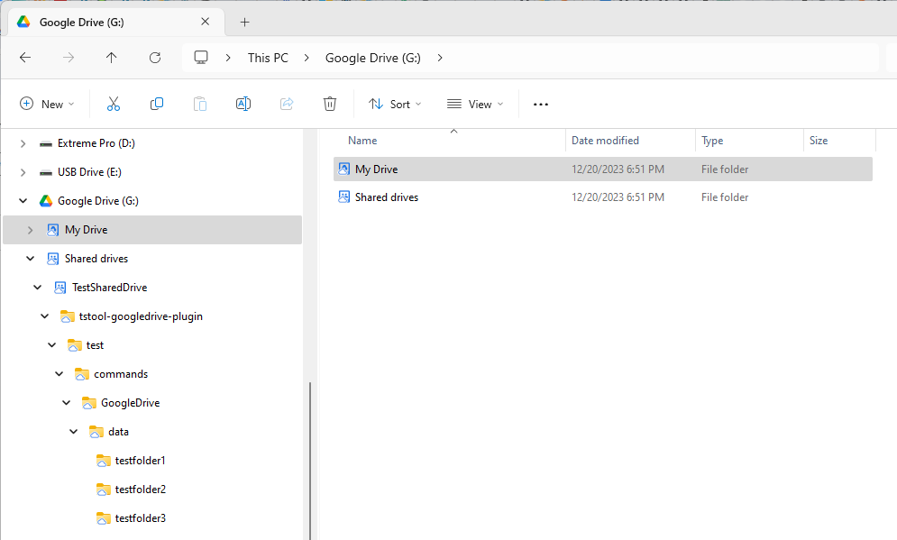
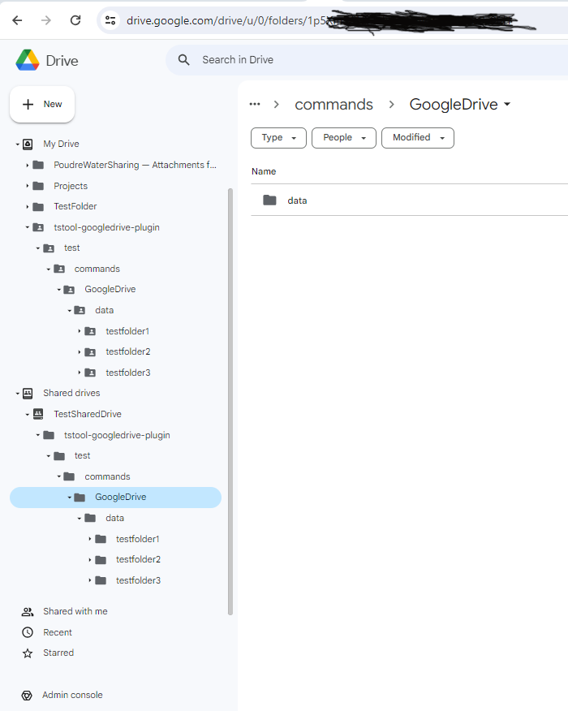
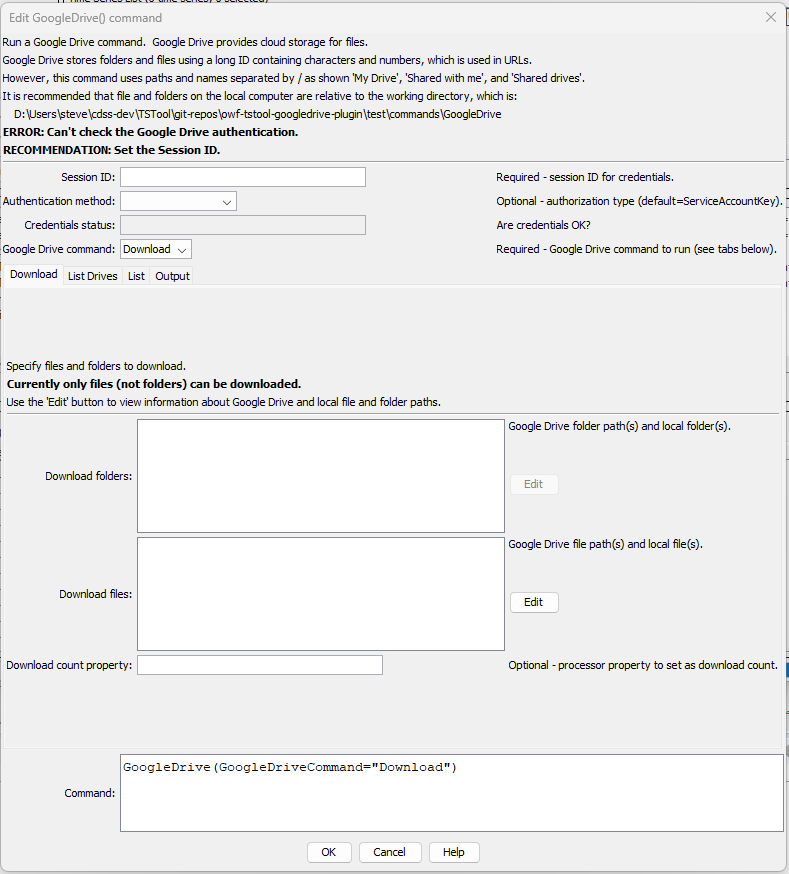
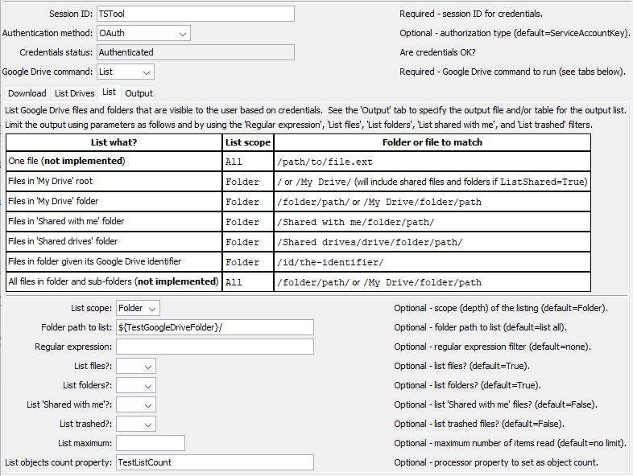
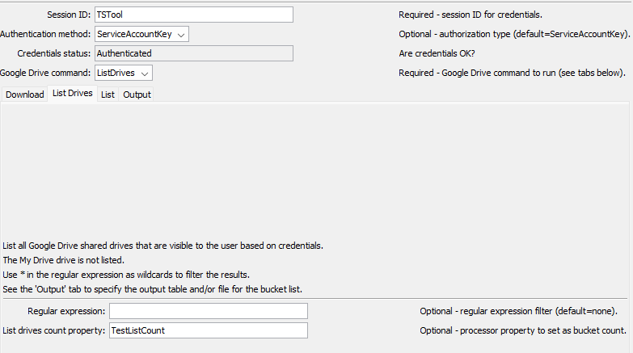

# TSTool / Command / GoogleDrive #

*   [Overview](#overview)
*   [Command Editor](#command-editor)
    +   [Download](#download) - download files and folders
    +   [List](#list) - list files and folders
    +   [List Drives](#list-drives) - list shared drives
*   [Command Syntax](#command-syntax)
    +   [General Command Parameters](#general-command-parameters)
        -   [Credential Files](#credential-files)
    +   [Download Command Parameters](#download-command-parameters)
    +   [List Command Parameters](#list-command-parameters)
    +   [List Drives Command Parameters](#list-drives-command-parameters)
    +   [Output Command Parameters](#output-command-parameters)
*   [Examples](#examples)
*   [Troubleshooting](#troubleshooting)
*   [See Also](#see-also)

-------------------------

## Overview ##

The `GoogleDrive` command performs tasks for [Google Drive](https://www.google.com/drive/),
which is used to store files in the cloud.

Google Drive concepts and terminology are used in the `GoogleDrive` command parameters:

*   Google Drive is authenticated in one of the following ways,
    which typically requires the Google account manager to configure authentication
    (see the [Enable API Appendix](../../appendix-enable-api/enable-api.md)):
    +   [OAuth2](https://developers.google.com/identity/protocols/oauth2)
    +   [API Key](https://cloud.google.com/docs/authentication/api-keys)
*   Google drive can be accessed using:
    +   Desktop software integrated with Windows File Explorer,
        in which case the `G:` (or another) drive maps to Google Drive files.
    +   Google Drive website, accessible from the upper right tool grid from Google Mail, Calendar, etc.
    +   Web Services API integrated with desktop and web applications,
        which is used by TSTool for this plugin.
*   Top-level files in Google Drive are organized under:
    +   `My Drive` folder:
        -   files and folders owned by the user
        -   desktop Google Drive also includes files and folders shared by others
    +   `Shared drives` folder:
        -   for drives that have been shared by others, which are shared workspaces
    +   `Shared with me` folder:
        -   the Google Drive web application shows a `Shared with me` folder
        -   the desktop Google Drive shows shared files and folders under `My Drive`
*   Google Drive folder and file objects are identified by:
    +   a long unique string containing characters and numbers,
        which is shown in URLs
    +   a path that maps to folders and files using `/` delimiter

The following shows how the above top-level Google Drive folders are shown in the desktop in Windows Explorer:

*   uses the `G:` drive letter (can be changed using Google Drive settings)
*   includes `My Drive` and `Shared drives` top level virtual drives
*   "Shared with me" folders and files are listed directly under `My Drive`
    but no `Shared with me` folder is used
*   paths are used to locate folders and files and can be opened in File Explorer and other applications
*   the Google Drive unique identifier for each folder and file is not shown
*   the icon typically shows a cloud when the streaming approach is used
    (store in the cloud and only save a local copy when editing locally)
*   sharing a folder or file will use the identifier,
    for example via a link in an email

**<p style="text-align: center;">

</p>**

**<p style="text-align: center;">
`GoogleDrive` Desktop Application (<a href="../GoogleDrive-desktop.png">see full-size image)</a>
</p>**

The following shows how the above top-level Google Drive folders are shown in the web application:

*   top-level objects include `My Drive`, `Shared drives`, and `Shared with me`,
    using different icons
*   paths are shown for folders and files using a "bread crumb trail" at the top of the page
*   the URL for a resource shows the unique identifier for the parent folder;
    however, if a file is selected, the URL does not show the identifier for the file
*   the icon shows whether the resource is shared (person in the folder)
*   sharing a folder or file will use the identifier,
    for example via a link in an email

**<p style="text-align: center;">

</p>**

**<p style="text-align: center;">
`GoogleDrive` Web Application (<a href="../GoogleDrive-web-app.png">see full-size image)</a>
</p>**

The above details are handled by this command so that Google Drive technical constraints do not need to be fully understood:

*   as much as possible, paths to folders and files are used rather than the identifier
*   provide features to operate on folders even when the Google Drive API does not provide these features (under development)
*   provide wildcard (`*`) features (under development)
*   using the API in TSTool allows Google Drive to be accessed on Windows and Linux

## Command Editor ##

The following dialog is used to edit the command and illustrates the syntax for the command.
Each `GoogleDrive` command has a tab for parameters specific to that command.
The ***Output*** tab is used with the `List` and `ListDrives` commands.

Command parameters are provided to help with automated tests and error checks.
For example the `ListCountProperty` parameter can be used to set a processor property
containing the number of items in the returned list.
Use the [`If`](https://opencdss.state.co.us/tstool/latest/doc-user/command-ref/If/If/) command to check the property value.

Notes at the top of the editor indicate whether the user's Google Drive configuration is authenticated and
if not an error message and recommendation are shown to help troubleshoot problems.
Editing a new command will always display an error message until a valid `SessionID` is specified.
See also the [Credential Files](#credential-files) section.

**<p style="text-align: center;">

</p>**

**<p style="text-align: center;">
`GoogleDrive` Command Editor (<a href="../GoogleDrive.png">see full-size image)</a>
</p>**

### Download ###

Use the `GoogleDriveCommand=Download` parameter to download files and folders to the local computer.

**Currently only files can be downloaded and wildcards are not enabled.**

**<p style="text-align: center;">

</p>**

**<p style="text-align: center;">
`GoogleDrive` Command Editor for Download Parameters (<a href="../GoogleDrive-Download.png">see full-size image)</a>
</p>**

### List ###

Use the `GoogleDriveCommand=List` parameter to list files and folders.
The folder/file identifier, name, and other properties are output to the specified table and/or file.
Refer to the table in the command editor for instructions.

The following example shows how to list a folder using OAuth authentication.
The folder to list is set to a path under `/My Drive` using a property.

**<p style="text-align: center;">

</p>**

**<p style="text-align: center;">
`Google Drive` Command Editor for List Parameters (<a href="../GoogleDrive-List-Folder-OAuth.png">see full-size image)</a>
</p>**

### List Drives ###

Use the `GoogleDriveCommand=ListDrives` parameter to list drives.
The drive identifier, name, and creation time are output to the specified table and/or file.

**<p style="text-align: center;">

</p>**

**<p style="text-align: center;">
`Google Drive` Command Editor for List Drives Parameters (<a href="../GoogleDrive-ListDrives.png">see full-size image)</a>
</p>**

### Output ###

The ***Output*** tab is used to specify output parameters and is used with the `GoogleDriveCommand=List` parameter.

**<p style="text-align: center;">

</p>**

**<p style="text-align: center;">
`GoogleDrive` Command Editor for Output Parameters (<a href="../GoogleDrive-output.png">see full-size image)</a>
</p>**

## Command Syntax ##

The command syntax is as follows:

```text
Googledrive(Parameter="Value",...)
```

The following tables list command parameters for each `GoogleDriveCommand` value.
The general parameters apply to all `GoogleDrive` commands, except where noted.

### General Command Parameters ###

General command parameters are used with most of the commands, except where noted.
Note that because these parameters are used to provide information in the editor,
the `${Property}` notation is not supported for some parameters and will cause issues for interactive command editing.

**<p style="text-align: center;">
Command Parameters - General
</p>**

|**Parameter**&nbsp;&nbsp;&nbsp;&nbsp;&nbsp;&nbsp;&nbsp;&nbsp;&nbsp;&nbsp;&nbsp;&nbsp;&nbsp;&nbsp;&nbsp;&nbsp;&nbsp;&nbsp;&nbsp;&nbsp;&nbsp;&nbsp;&nbsp;&nbsp;&nbsp;|**Description**|**Default**&nbsp;&nbsp;&nbsp;&nbsp;&nbsp;&nbsp;&nbsp;&nbsp;&nbsp;&nbsp;&nbsp;&nbsp;&nbsp;&nbsp;&nbsp;&nbsp;&nbsp;&nbsp;&nbsp;&nbsp;&nbsp;&nbsp;&nbsp;&nbsp;&nbsp;&nbsp;&nbsp;|
|--------------|-----------------|-----------------|
|`SessionID`<br>**required**|A session identifier, which is used to determine credential file names. See the [Credential Files](#credential-files) section. | None - must be specified. |
|`AuthenticationMethod`| Authentication method to use as per the [Enable API Appendix](../../appendix-enable-api/enable-api.md): <ul><li>`OAuth` - OAuth 2.0</li><li>`ServiceAccountKey` - service account API key</li></ul> | `ServiceAccountKey` |
|`Credentials status:` | A note that indicates whether the credentials have been authenticated. |
|`GoogleDriveCommand`<br>**required**|The Google Drive command to run, which indicates which tab's parameters are used. | None - must be specified. |
|`IfInputNotFound`| Message level when input is not found:  `Ignore`, `Warn`, or `Fail`. This is under development. | `Warn` |

#### Credential Files ####

See the [Appendix - Enable API](../../appendix-enable-api/enable-api.md) documentation for information about
enabling the Google Drive API.

The `SessionID` parameter is used to indicate the credential file to use for the command.
A credential file must be provided to allow OAuth or a service account key to be authenticated.
Separate credential files are used for each authentication method.

Multiple credential files can be created for different access levels,
which can be coordinated in an organization to manage automated workflows.

### Download Command Parameters ###

Use the following combination of parameters with `GoogleDriveCommand=Download` to download files.

**<p style="text-align: center;">
Command Parameters - Download
</p>**

|**Parameter**&nbsp;&nbsp;&nbsp;&nbsp;&nbsp;&nbsp;&nbsp;&nbsp;&nbsp;&nbsp;&nbsp;&nbsp;&nbsp;&nbsp;&nbsp;&nbsp;&nbsp;&nbsp;&nbsp;&nbsp;&nbsp;&nbsp;&nbsp;&nbsp;&nbsp;&nbsp;&nbsp;&nbsp;&nbsp;&nbsp;&nbsp;&nbsp;&nbsp;|**Description**|**Default** |
|-----|-----------------|-----------------|
|`DownloadFolders`| **Not implemented.** | |
|`DownloadFiles`| List of files to download using syntax: `GoogleDrivePath1:LocalPath1,GoogleDrivePath2:LocalPath2`, where the Google Drive path identifies a Google Drive file and `LocalPath` is the path to the local file. Can use `${Property}` syntax. If the end of the local file part of the path is `/*`, then the local file name will be set to the Google Drive file name.  The start of the Google Drive path can be one of the following to indicate the location of the Google Drive file: <ul><li>`/My Drive/` (or no `/My Drive/`) to match files in `My Drive`</li><li>`/Shared drives/drivename/` - to match files in a shared drive</li><li>`/Shared with me/` - to match files in `Shared with me`</li></ul>| |
|`DownloadCountProperty`| Processor property to set containing the number of files downloaded. | |

### List Command Parameters ###

Use the following combination of parameters with `GoogleDriveCommand=List` to list files and folders.

**<p style="text-align: center;">
Parameter Combinations to List Files and Folders
</p>**

| **List What?** | **`ListScope` Parameter** | **`ListFolder` Parameter** |
| -- | -- | -- |
|  One file (**not implemented**) | `All` | `/path/to/file` |
| Files in `My Drive` root | `Folder` | `/` or `/My Drive` (will include shared files and folders if `ListSharedWithMe=True`. |
| Files in `My Drive` folder | `Folder` | `/folder/path/` or `/My Drive/folder/path/`. |
| Files in `Shared with me` folder | `Folder` | `/Shared with me/folder/path/`. |
| Files in `Shared drives` folder | `Folder` | `/Shared drives/drive/folder/path/`. |
| Files in folder given its Google Drive identifier | `Folder` | `/id/identifier/`. |
| All files in folder and sub-folders (**not implemented**) | `All` | `/folder/path/` or `/My Drive/folder/path/`. |

**<p style="text-align: center;">
Command Parameters - List Files and Folders 
</p>**

|**Parameter**&nbsp;&nbsp;&nbsp;&nbsp;&nbsp;&nbsp;&nbsp;&nbsp;&nbsp;&nbsp;&nbsp;&nbsp;&nbsp;&nbsp;&nbsp;&nbsp;&nbsp;&nbsp;&nbsp;&nbsp;&nbsp;&nbsp;&nbsp;&nbsp;&nbsp;&nbsp;&nbsp;&nbsp;&nbsp;&nbsp;&nbsp;&nbsp;&nbsp;|**Description**|**Default** |
|-----|-----------------|-----------------|
|`ListScope` | Indicates how deep the listing is:<ul><li>`All` - list all files and subfolder contents</li><li>`Folder` - list only the contents of a specific folder but not the contents of subfolders</li></ul> Use the `ListFiles`, `ListFolders`, `ListSharedWithMe`, `ListTrashed`, and `ListRegEx` parameters to further constrain output. | `All` |
|`ListFolder`| Folder to list:<ul><li>When listing a folder's contents, indicate the folder to list with leading and trailing `/` (e.g., `/folder1/folder2/)`</li></ul>. | `Folder` |
|`ListRegEx`| Regular expression to filter folder and file names:<ul><li>use `*` as a wildcard</li><li>`java:...` - specify a [Java regular expression](https://docs.oracle.com/javase/8/docs/api/java/util/regex/Pattern.html#sum) - **not fully tested**</li></ul> | All files and folders in the `ListScope` are listed. |
|`ListFiles` | Whether files are listed, `True` or `False`. | `True` |
|`ListFolders` | Whether folders are listed, `True` or `False`. | `True` |
|`ListSharedWithMe` | Whether files that have been shared are listed, `True` or `False`.  Use when listing the `My Drive` root folder. | `False` |
|`ListTrashed` | Whether files that have been moved to the recycling bin (deleted) are listed, `True` or `False`. Trashed files are automatically removed after approximately 30 days. | `False` |
|`ListMax`| The maximum number of folders and files to output. | `1000` API default. |
|`ListCountProperty`| Processor property to set containing the number of output files and folders in the list. If appending to output (***Output*** `AppendOutput=True`) the count will be the total count. | |

### List Drives Command Parameters ###

Use the following combination of parameters with `GoogleDriveCommand=ListDrives` to list shared drives.
`My Drive` is not included in the output.

**<p style="text-align: center;">
Command Parameters - List Drives
</p>**

|**Parameter**&nbsp;&nbsp;&nbsp;&nbsp;&nbsp;&nbsp;&nbsp;&nbsp;&nbsp;&nbsp;&nbsp;&nbsp;&nbsp;&nbsp;&nbsp;&nbsp;&nbsp;&nbsp;&nbsp;&nbsp;&nbsp;&nbsp;&nbsp;&nbsp;&nbsp;&nbsp;&nbsp;&nbsp;&nbsp;&nbsp;&nbsp;&nbsp;&nbsp;|**Description**|**Default** |
|-----|-----------------|-----------------|
|`ListDrivesRegEx`| Regular expression to filter drive names:<ul><li>use `*` as a wildcard</li><li>`java:...` - specify a [Java regular expression](https://docs.oracle.com/javase/8/docs/api/java/util/regex/Pattern.html#sum) - **not fully tested**</li></ul> | All shared drives are listed. |
|`ListDrivesCountProperty`| Processor property to set containing the number of output drives in the list. If appending to output (***Output*** `AppendOutput=True`) the count will be the total count. | |

### Output Command Parameters ###

The following parameters are used with `GoogleDriveCommand=List` command.
Output from this `GoogleDrive` command can be saved to a table and/or file.
If a table is output with an output file, the table is used to create the output file.
If outputting to a file only, a temporary table is used internally and then the file is created from the table.

**<p style="text-align: center;">
Command Parameters - Output
</p>**

|**Parameter**&nbsp;&nbsp;&nbsp;&nbsp;&nbsp;&nbsp;&nbsp;&nbsp;&nbsp;&nbsp;&nbsp;&nbsp;&nbsp;&nbsp;&nbsp;&nbsp;&nbsp;&nbsp;&nbsp;&nbsp;&nbsp;&nbsp;&nbsp;&nbsp;&nbsp;|**Description**|**Default**&nbsp;&nbsp;&nbsp;&nbsp;&nbsp;&nbsp;&nbsp;&nbsp;&nbsp;&nbsp;&nbsp;&nbsp;&nbsp;&nbsp;&nbsp;&nbsp;&nbsp;&nbsp;&nbsp;&nbsp;&nbsp;&nbsp;&nbsp;&nbsp;&nbsp;&nbsp;&nbsp;|
|--------------|-----------------|-----------------|
|`OutputTableID`| Table identifier for output, used with list commands, can use `${Property}` syntax.  | |
|`OutputFile`| Name of file for output, used with list commands, can use `${Property}` syntax.  The file extension (`.csv`) indicates the format. Currently only `csv` format is supported.  If necessary, write the table to a different format using a separate command.| |
|`AppendOutput` | Append the output to an existing table (and file).  Create the table/file if they do not exist. | Overwrite the existing table and file without appending. |

## Examples ##

See the [automated tests](https://github.com/OpenWaterFoundation/owf-tstool-googledrive-plugin/tree/master/test/commands/GoogleDrive).
Automated tests require Google Drive API permissions to run and are configured for Open Water Foundation tests.

## Troubleshooting ##

If there is an error, view the TSTool log file using the ***Tools / Diagnostics - View Log File...*** menu.
If necessary, use the 
[`SetDebugLevel`](https://opencdss.state.co.us/tstool/latest/doc-user/command-ref/SetDebugLevel/SetDebugLevel/)
command to troubleshoot (turn debug on to the log file before a command and then set levels to zero after a command).

## See Also ##

*   [Appendix - Enable API](../../appendix-enable-api/enable-api.md)
*   [`If`](https://opencdss.state.co.us/tstool/latest/doc-user/command-ref/If/If/) command
*   [`SetDebugLevel`](https://opencdss.state.co.us/tstool/latest/doc-user/command-ref/SetDebugLevel/SetDebugLevel/) command
