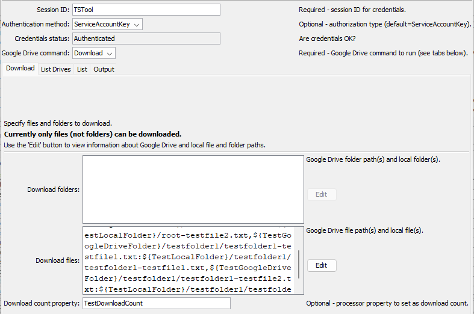

# TSTool / Command / GoogleDrive #

*   [Overview](#overview)
*   [Command Editor](#command-editor)
    +   [List Files](#list-files)
*   [Command Syntax](#command-syntax)
    +   [General Command Parameters](#general-command-parameters)
    +   [List Files Command Parameters](#list-files-command-parameters)
    +   [Output Command Parameters](#output-command-parameters)
*   [Examples](#examples)
*   [Troubleshooting](#troubleshooting)
*   [See Also](#see-also)

-------------------------

## Overview ##

The `GoogleDrive` command performs tasks for [Google Drive](https://www.google.com/drive/),
which is used to store files in the cloud.

Google Drive concepts and terminology are used in the `GoogleDrive` command parameters:

*   Google Drive is authenticated in one of the following ways,
    which typically requires the Google account manager to configure authentication
    (see the [Enable API Appendix](../../appendix-enable-api/enable-api.md)):
    +   [OAuth2](https://developers.google.com/identity/protocols/oauth2)
    +   [API Key](https://cloud.google.com/docs/authentication/api-keys)
*   Google drive can be accessed using:
    +   Desktop software integrated with Windows File Explorer,
        in which case the `G:` (or similar) drive maps to Google Drive files.
    +   Google Drive website, accessible from the upper right tool grid from Google Mail, Calendar, etc.
    +   Web Services API integrated with desktop and web applications, as is used by TSTool.
*   Top-level files in Google Drive are organized under:
    +   `My Drive` folder for files owned by the user.
    +   `Shared drives` folder for files that have been shared by others.
*   Google Drive folder and file objects are identified by:
    +   a long unique string containing characters and numbers,
        which is shown in URLs
    +   a path in Google Drive that maps to folders and files using `/` delimiter

The above complexities are handled by this command so that Google Drive technical constraints do not need to be fully understood:

*   as much as possible, avoid the identifier strings and use paths to folders and files
*   provide features to operate on folders even when the Google Drive API does not provide these features (under development)
*   provide wildcard (`*`) features (under development)
*   using the API in TSTool allows Google Drive to be accessed on Windows and Linux

## Command Editor ##

The following dialog is used to edit the command and illustrates the syntax for the command.
Each `GoogleDrive` command has a tab for parameters specific to that command.
The ***Output*** tab is used with multiple commands, as noted.

Command parameters are provided to help with automated tests and error checks.
For example the `ListCountProperty` parameter can be used to set a processor property
containing the number of buckets in the returned list.
Use the [`If`](https://opencdss.state.co.us/tstool/latest/doc-user/command-ref/If/If/) command to check the property value.

### Download ###

Use the `GoogleDriveCommand=Download` parameter to download files and folders to the local computer.

**Currently only files can be downloaded and wildcards are not enabled.**

**<p style="text-align: center;">

</p>**

**<p style="text-align: center;">
`GoogleDrive` Command Editor for Download Parameters (<a href="../GoogleDrive-download.png">see full-size image)</a>
</p>**

### List ###

Use the `GoogleDriveCommand=List` parameter to list files and folders.
Refer to the table in the command editor for instructions.

Listing the contents of a folder only (not all subfolders) will list subfolder names without their contents.

**Currently only the contents of a folder can be listed.
Listing the root folder and subfolders will be enabled later.**

**<p style="text-align: center;">

</p>**

**<p style="text-align: center;">
`Google Drive` Command Editor for List Parameters (<a href="../GoogleDrive-list.png">see full-size image)</a>
</p>**

### Output ###

The ***Output*** tab is used to specify output parameters and is used with the `GoogleDriveCommand=List` parameter.

**<p style="text-align: center;">

</p>**

**<p style="text-align: center;">
`GoogleDrive` Command Editor for Output Parameters (<a href="../GoogleDrive-output.png">see full-size image)</a>
</p>**

## Command Syntax ##

The command syntax is as follows:

```text
Googledrive(Parameter="Value",...)
```

The following tables list command parameters for each `GoogleDriveCommand` value.
The general parameters apply to all `GoogleDrive` commands, except where noted.

### General Command Parameters ###

General command parameters are used with most of the commands, except where noted.
Note that because these parameters are used to provide information in the editor,
the `${Property}` notation is not supported for some parameters and will cause issues for interactive command editing.

**<p style="text-align: center;">
Command Parameters - General
</p>**

|**Parameter**&nbsp;&nbsp;&nbsp;&nbsp;&nbsp;&nbsp;&nbsp;&nbsp;&nbsp;&nbsp;&nbsp;&nbsp;&nbsp;&nbsp;&nbsp;&nbsp;&nbsp;&nbsp;&nbsp;&nbsp;&nbsp;&nbsp;&nbsp;&nbsp;&nbsp;|**Description**|**Default**&nbsp;&nbsp;&nbsp;&nbsp;&nbsp;&nbsp;&nbsp;&nbsp;&nbsp;&nbsp;&nbsp;&nbsp;&nbsp;&nbsp;&nbsp;&nbsp;&nbsp;&nbsp;&nbsp;&nbsp;&nbsp;&nbsp;&nbsp;&nbsp;&nbsp;&nbsp;&nbsp;|
|--------------|-----------------|-----------------|
|`GoogleDriveCommand`<br>**required**|The Google Drive command to run, which indicates which tab's parameters are used. | None - must be specified. |
|`AuthenticationMethod`| Authentication method to use as per the [Enable API Appendix](../../appendix-enable-api/enable-api.md): <ul><li>`OAuth` - OAuth 2.0</li><li>`ServiceAccountKey` - service account API key</li></ul> | `ServiceAccountKey` |
|`IfInputNotFound`| Message level when input is not found:  `Ignore`, `Warn`, or `Fail`. This is under development. | `Warn` |

### List Command Parameters ###

Use the following combination of parameters with `GoogleDriveCommand=List` to list files and folders.

**<p style="text-align: center;">
Parameter Combinations to List Files and Folders
</p>**

| **List What?** | **`ListScope`** | **`ListFolder`** |
| -- | -- | -- |
| **Not enabled:** One file | `All` (default) | Path for the object (`/path/to/file`). |
| **Not enabled:** Files in `My Drive` | `Folder` | `/` |
| Files in folder | `Folder` | Folder path ending in `/`. |
| **Not enabled:** All files and subfolders in a folder | `All` (default) | Folder path to match. |
| **Not enabled:** All files in `My Drive` | `All` (default). | |

**<p style="text-align: center;">
Command Parameters - List Files and Folders 
</p>**

|**Parameter**&nbsp;&nbsp;&nbsp;&nbsp;&nbsp;&nbsp;&nbsp;&nbsp;&nbsp;&nbsp;&nbsp;&nbsp;&nbsp;&nbsp;&nbsp;&nbsp;&nbsp;&nbsp;&nbsp;&nbsp;&nbsp;&nbsp;&nbsp;&nbsp;&nbsp;&nbsp;&nbsp;&nbsp;&nbsp;&nbsp;&nbsp;&nbsp;&nbsp;|**Description**|**Default** |
|-----|-----------------|-----------------|
|`ListScope` | Indicates how deep the listing is:<ul><li>`All` - list all files and subfolder contents</li><li>`Folder` - list only the contents of a specific folder but not the contents of subfolders</li></ul> Use the `ListFiles`, `ListFolders`, and `ListRegEx` parameters to further constrain output. | `All` |
|`ListFolder`| Folder to list:<ul><li>When listing a folder's contents, indicate the folder to list with trailing `/` (e.g., `folder1/folder2/)`</li><li>do not include leading `G:/My Drive`</li></ul>. | `Folder` |
|`LisRegEx`| Regular expression to filter objects:<ul><li>use `*` as a wildcard</li><li>`java:...` - specify a [Java regular expression](https://docs.oracle.com/javase/8/docs/api/java/util/regex/Pattern.html#sum) - **not fully tested**</li></ul> | All files and folders in the `ListScope` are listed. |
|`ListFiles` | Whether files are listed, `True` or `False`. | `True` |
|`ListFolders` | Whether folders are listed, `True` or `False`. | `True` |
|`ListTrashed` | Whether files that have been moved to the recycling bin (deleted) are listed, `True` or `False`. Trashed files are automatically removed after approximately 30 days. | `False` |
|`MaxKeys`| Not currently used. | |
|`MaxObjects`| Not currently used. | |
|`ListCountProperty`| Processor property to set containing the number of output files and folders in the list. If appending to output (***Output*** `AppendOutput=True`) the count will be the total count. | |

### Output Command Parameters ###

The following parameters are used with `GoogleDriveCommand=List` command.
Output from this `GoogleDrive` command can be saved to a table and/or file.
If a table is output with an output file, the table is used to create the output file.
If outputting to a file only, a temporary table is used internally and then the file is created from the table.

**<p style="text-align: center;">
Command Parameters - Output
</p>**

|**Parameter**&nbsp;&nbsp;&nbsp;&nbsp;&nbsp;&nbsp;&nbsp;&nbsp;&nbsp;&nbsp;&nbsp;&nbsp;&nbsp;&nbsp;&nbsp;&nbsp;&nbsp;&nbsp;&nbsp;&nbsp;&nbsp;&nbsp;&nbsp;&nbsp;&nbsp;|**Description**|**Default**&nbsp;&nbsp;&nbsp;&nbsp;&nbsp;&nbsp;&nbsp;&nbsp;&nbsp;&nbsp;&nbsp;&nbsp;&nbsp;&nbsp;&nbsp;&nbsp;&nbsp;&nbsp;&nbsp;&nbsp;&nbsp;&nbsp;&nbsp;&nbsp;&nbsp;&nbsp;&nbsp;|
|--------------|-----------------|-----------------|
|`OutputTableID`| Table identifier for output, used with list commands, can use `${Property}` syntax.  | |
|`OutputFile`| Name of file for output, used with list commands, can use `${Property}` syntax.  The file extension (`.csv`) indicates the format. Currently only `csv` format is supported.  If necessary, write the table to a different format using a separate command.| |
|`AppendOutput` | Append the output to an existing table (and file).  Create the table/file if they do not exist. | Overwrite the existing table and file without appending. |

## Examples ##

See the [automated tests](https://github.com/OpenWaterFoundation/owf-tstool-googledrive-plugin/tree/master/test/commands/GoogleDrive).
Automated tests require AWS permissions to run.

## Troubleshooting ##

If there is an error, view the TSTool log file using the ***Tools / Diagnostics - View Log File...*** menu.
If necessary, use the 
[`SetDebugLevel`](https://opencdss.state.co.us/tstool/latest/doc-user/command-ref/SetDebugLevel/SetDebugLevel/)
command to troubleshoot (turn debug on to the log file before a command and then set levels to zero after a command).

## See Also ##

*   [`If`](https://opencdss.state.co.us/tstool/latest/doc-user/command-ref/If/If/) command
*   [`SetDebugLevel`](https://opencdss.state.co.us/tstool/latest/doc-user/command-ref/SetDebugLevel/SetDebugLevel/) command
